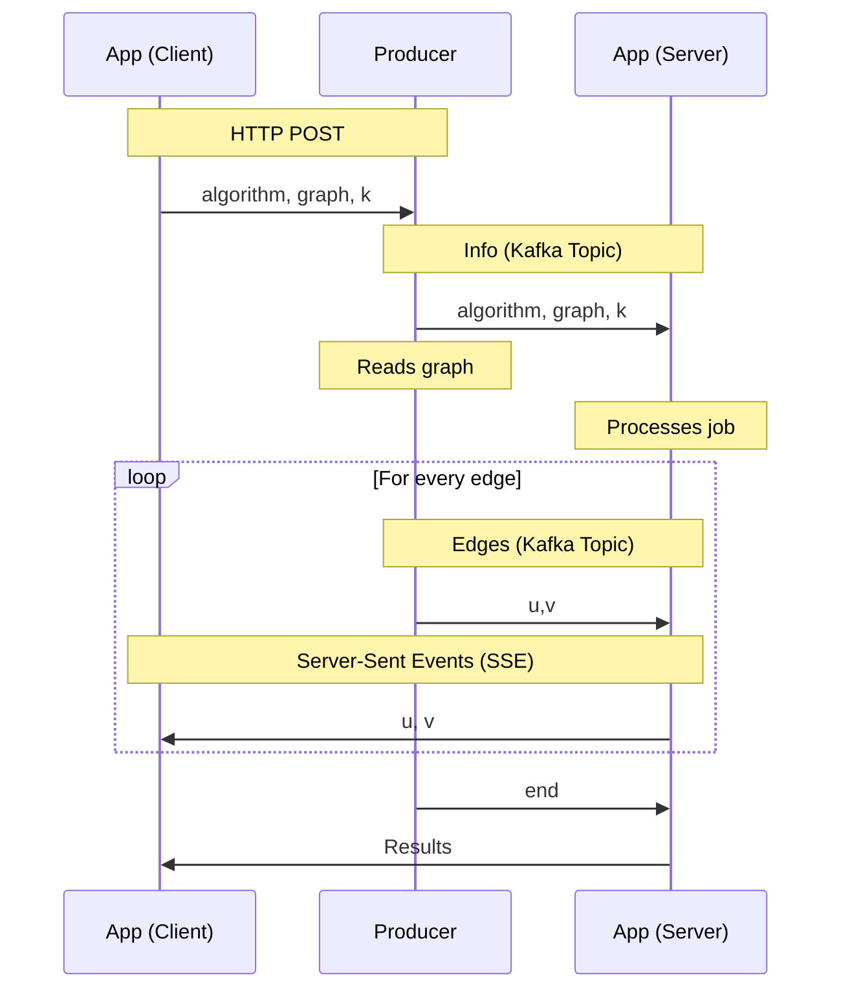
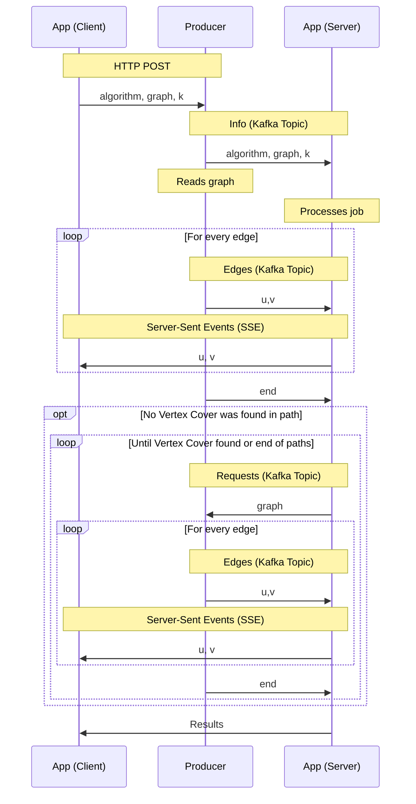

# Stream Architecture

## Kernelization

```mermaid
sequenceDiagram
    Note over App (Client),Producer: HTTP POST
    App (Client)->>Producer: algorithm, graph, k
    Note over Producer,App (Server): Info (Kafka Topic)
    Producer->>App (Server): algorithm, graph, k
    Note over Producer: Reads graph
    Note over App (Server): Processes job
    loop For every edge
        Note over Producer, App (Server): Edges (Kafka Topic)
        Producer->>App (Server): u,v
        Note over App (Server),App (Client): Server-Sent Events (SSE)
        App (Server)->>App (Client): u, v
    end
    Producer->>App (Server): end
    App (Server)->>App (Client): Results
```

## Branching

```mermaid
sequenceDiagram
    Note over App (Client),Producer: HTTP POST
    App (Client)->>Producer: algorithm, graph, k
    Note over Producer,App (Server): Info (Kafka Topic)
    Producer->>App (Server): algorithm, graph, k
    Note over Producer: Reads graph
    Note over App (Server): Processes job
    loop For every edge
        Note over Producer, App (Server): Edges (Kafka Topic)
        Producer->>App (Server): u,v
        Note over App (Server),App (Client): Server-Sent Events (SSE)
        App (Server)->>App (Client): u, v
    end
    Producer->>App (Server): end
    opt No Vertex Cover was found in path
        loop Until Vertex Cover found or end of paths
            Note over Producer,App (Server): Requests (Kafka Topic)
            App (Server)->>Producer: graph
            loop For every edge
                Note over Producer, App (Server): Edges (Kafka Topic)
                Producer->>App (Server): u,v
                Note over App (Server),App (Client): Server-Sent Events (SSE)
                App (Server)->>App (Client): u, v
            end
            Producer->>App (Server): end
        end
    end
    App (Server)->>App (Client): Results
```
