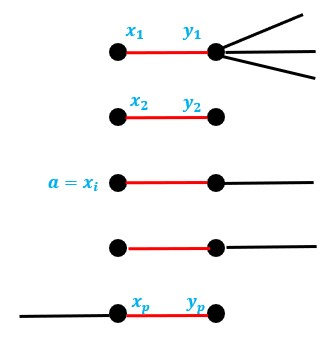

# On Parameterized Vertex Cover in Streaming

## Abstract

> The goal of the abstract is to give a complete overview of: the problem you identified, the approach you took/what you produced, your evaluation of it, what it all means.
>
> 250-300 words

With the size of datasets growing in the order of magnitudes, there has been greater 8demand for techniques to process the data. Streaming algorithms have been shown to be a strong contender in order to tackle this. While these datasets have been growing, many of the classical problems questioned about these datasets have not changed and neither has the order of their output size. This gives us a perfect environment to take advantage of parameterized complexity. Vertex Cover is one such such classical problem that has had parameterized streaming algorithms developed for it in recent years. However, many of these algorithms still lie in unimplemented theoretical space. 

This paper aims to build a base on how to go about implementing streaming algorithms and to provide aids in understanding of how these algorithms work. We provide as-is implementations from previous work as well as optimised implementations, visualisations, performance profiling against graphs from a number of different domains, and a proof-of-concept streaming platform. All together, we believe our work provides all the tools needed to further development in bringing this class of algorithms out of theoretical space.

> needs more about memory parameterization

[TOC]

## Introduction

> Remember your readers, especially your 2nd marker might have no knowledge of the topic of your project. The introduction is your chance to tell them what your project is about. What is the topic of your project? What are the problems? Why is it important? In the introduction you are trying, at a high-level to give the reader an idea of these issues. Convince them that your project is something interesting that's worth working on.

Parameterized Vertex Cover in Streaming. That is the problem.

When you think of streaming, Netflix may be the first thought that comes to mind. But Film and TV isn't the only thing that streaming can be used for. Streaming is now quite widely used in the enterprise space for real-time data. Where data is being reported from sensors in a system for use in monitoring. Streaming is also used in many systems for logging purposes. Actions that users make in a system need to be tracked for analytics so whenever they make an action an event log is created and sent to a stream of all the other users' actions. These can be then aggregated very quickly and efficiently to gain actual insight from.

Non-parameterized/classical TIME : 1960s

parameterized TIME : 1990s

Non-parameterized SPACE :2000s

parameterized SPACE :2015

---

My supervisor Rajesh Chitnis had previously been researching the problem of parameterized vertex cover. I found that none of the algorithms he talked about had ever been put into practice, only ever written theoretically.

## Motivation

> - What is the general problem?
> - Why is it worth working on?
> - Who else as worked on this problem?
> - What did they find?
> - Given this, what is the specific problem you will solve?

Vertex cover is a classical problem which has found many use cases. Here's a typical example. Imagine a heavily connected road network in a city. The city council wants to figure out the most cost effective placement of cameras so that they are able to see every road (assume the cameras can see 360$^\circ$). The way of calculating this mathematically would be as a vertex cover of a graph where each intersection was a node and each road between them is an edge. For cities nowadays, this graph can be too big to compute using traditional methods. So we need updated methods to handle this.

## Background

### Concepts

For the reader unfamiliar with these concepts an explanation has been provided for each of the concepts covered in this paper. For those simply unfamiliar with abbreviations, a glossary has been provided.

**Graph Theory**: the study of mathematical structures which are used to show pairwise relations between objects.

**Vertex Cover**: a set of vertices such that each edge of a graph is incident to at least one vertex of the set. The problem of finding a minimum vertex cover (the smallest possible) is a classical optimization problem and is a typical example of an NP-hard problem. The decision version (where we only want a yes/no answer), known as the Vertex Cover Problem, is one of Karp's 21 NP-complete problems. This makes is a very classical problem. Formally, given a graph $G = (V, E)$ and a vertex cover $V'$:

$V' \subset V \text{ such that } \forall (u, v) \in E \Rightarrow u \in V' \vee v \in V'$

**Parameterized complexity**: A branch of computational complexity theory that focusses on classifying computational problems according to their inherent difficulty with respect to multiple parameters of the input or output. The complexity of the problem is then measured as a function of those parameters. The vertex cover problem is fixed-parameter tractable, meaning that, while it may be NP-complete in terms of the input size only, it is polynomial in the output of a vertex cover size $k$.

**Fixed Parameter Tractable**:

**Parameterized Vertex Cover**:

**Streaming Algorithms**: We now live in a world where data is the most valuable resource. Given such, it's no surprise that we're drowning in it. Datasets have become larger than what we can store on hard drives. The solution is to not store the dataset. Simply stream it as one item at a time. Streaming algorithms have been developed to handle this, being able to gather information while having access to a limited amount of memory.

### Branching

> Talk about the non-streaming branching algorithm?


### Kernelization

> Talk about the non-streaming kernel?



## Literature Review

> - Parameterized Streaming Algorithms for Vertex Cover, 2014
> - Towards a Theory of Parameterized Streaming Algorithms, 2019
>
> 1. **Search** for relevant literature
> 2. **Evaluate** sources
> 3. **Identify** themes, debates and gaps
> 4. **Outline** the structure
> 5. **Write** your literature review
>
> A good literature review doesn’t just summarise sources – it analyses, synthesises, and critically evaluates to give a clear picture of the state of knowledge on the subject.

## Method

> - What are you doing?
> - How are you doing it?
> - Why are you doing it this way?

In researching for this paper, more often than not we found that, while the core concepts weren't too difficult to get our heads around, the higher level explanations would often go right over our heads.

Our work here covers three areas which we think would increase accessibility into the field.

1. As with any widely adopted algorithm, clear explanation of how the algorithm works in practice is essential. This includes efforts to visualise the algorithms in action. As with most state-of-the-art research it takes many years of studying to even be able to understand what the papers are talking about, let alone being able to understand the pseudocode that is provided.
2. Practical evidence of performance of the algorithms. While Big-O notation is a good indicator of runtime and memory performance, those only refer to average performance which few, if any, datasets will fit. Seeing whether your problem area is suitable to have a specific algorithm applied to it is crucial.
3. Aid in choosing the correct tools. There exist many tools and platforms nowadays for the development of streaming systems. As with many modern tooling, each have their fair share of buzzwords and jargon most are forced to wade through before fully understanding what a tools function even is.

Python is good. Wide adoption in data science so has many tools in big data. Also, more importantly, used for many streaming applications in the Apache line-up.

Build first locally to test correctability. Implement a faux-stream using file streaming (reading line-by-line) then implement a proof-of-concept networked system to show how the system might be used in a real world example.

I identified three separate use cases where a vertex cover (or any graph) algorithm could be applied depending on the size and source of the graph given. These two attributes, size and source, each bubble down to two sub-cases.

Size:

- In-memory - The graph is small enough to store within memory. This means that actions can be performed on the graph taking in account the entire graph.
- Out-of-memory - The graph is too large to store within memory in it's entirety. Actions must now be made on small parts of the graph without the knowledge of other parts.

Source:

- Local - You have direct access to the graph, for example, in the form of a file.
- Network - You do not have direct access, the data is streamed to you in pieces. This may be either due to the size of the data (it being too large to feasibly store) or due to the nature of the data. This nature being that it doesn't yet exist as stored data and so must be processed in some way from pre-existing data.

### The Algorithms

#### Branching - Non-Stream

```
Pseudocode
```

#### Branching - Stream

```
Pseudocode
```

#### Kernelization - Non-Stream

```
Pseudocode
```

#### Kernelization - Stream

```
Pseudocode
```

### Local - Visualisation

This is the traditional case. The graph is small enough to use in-memory and you have local access to it so you are able to use which ever tools you wish to calculate the vertex cover.

##### NetworkX


In order to aid in the understanding of algorithms, it is often helpful to create visualisations. So I did just that.


### Local-Stream - Performance Profiling

In this case the graph is no longer large enough to store in-memory but you are able to have direct access to it. The graph may be large but it is feasible to store the graph on disk since disk sizes are often many magnitudes larger than that of memory. Traditional algorithms are no longer applicable here, this is the first example where the invention of streaming algorithms is a necessity.

There are a number of ways the above algorithms could be constructed to be made for user friendly and easy to apply to problems.

#### `find_vertex_cover` (branching)

This is simply using the branching algorithm. For the situation where you already know your k value. You may already know this value because you know your memory limits or have a budget.

#### `find-kernel` (kernelization)

This is simply using the kernelization algorithm. Shrinking a given input down to it's most important core.

#### `find_vertex_cover_efficient` (kernelization-branching)

This combines the algorithms using the kernelized graph and passing that into the branching algorithm.

#### `find_min_vertex_cover` (branching-min)

This uses the branching algorithm in a binary search to find the minimum size a vertex cover could be.

#### `find_min_vertex_cover_efficient` (kernelization--branching-min)

This then combines the previous two for a complete solution to find a minimum vertex cover for a given stream.

#### Datasets

Eventually you get to a point when the datasets become too large to even read.


Visual Studio Code, a more modern text editor, is able to open the file however not without performance issues even when wrapping and folding have been turned off.


There is even a limit for Visual Studio Code though.


#### Testing and Comparison

We don't live in a world anymore where we have to hack our way around machines to push the limits of their memory just so we can play some games. We haven't for a while. This goes the same for algorithms. Most of the time, we will happily sacrifice memory efficiency for any extra pittance of time efficiency. Memory is is dispensable, our time is not. This may still be true for streaming algorithms, but only to an extent. We are very much interested in both time and space complexity here. And so, we need to test as such.

Testing will be carried out across all three domains. Each will be tested against the same set of datasets which will include graphs from a variety of sources. Some synthetic, some constructed, some realistic. Varying in densities. It is important to account for these factors in our datasets as input size isn't the only thing that affects graph algorithms.

Measuring runtime will be handled by Python's  `time.perf_counter_ns` which is a clock designed for performance testing; it being monotonic and ~~SOMETHING ELSE~~. Memory will be measure through a python memory profiler called `memory-profiler`.  Each domain, algorithm, and dataset will be run through both a number of times to achieve a result ~~hopefully~~ devoid of inconsistencies.

### Stream - Proof-of-Concept

This is the main case. In a typical situation, knowledge of the graph's attributes will be limited so it should be treated as a unbounded stream (a stream that has no end). The opposite of this would be treating it as a bounded stream, where we know there is an end to the stream.

##### Batch vs Stream processing

Most "streaming" applications work on **unbounded** streams. These are data streams which are essentially infinite. Examples include: sensor readings and application logging. In these cases, the objective is not to obtain a final result but to aggregate the data before storing it for future use. This would be classed as **stream processing**.

Our problem of Vertex Cover would be classed as **batch processing**. We may be working on a data stream but once either algorithm has completed we won't need to run it again.

Most streaming platforms (especially those in the Apache line up) work on unbounded stream processing. So finding a streaming platform appropriate for batch processing was a little more tricky. There are a number of "graph" processing frameworks.

> To build a streaming data pipeline, we'll need a few tools.
>
> First, you’ll require an in-memory framework (such as Spark), which handles batch, real-time analytics, and data processing workloads. You’ll also need a streaming platform (Kafka is a popular choice, but there are others on the market) to build the streaming data pipeline. In addition, you’ll also need a NoSQL database (many people use HBase, but you have a variety of choices available).
>
> Step three is to fetch the data from the streaming platform. Next, we'll process the data. The fifth step is to manage the pipeline to ensure everything is working as it’s supposed to.

Streaming platforms are the base on which a data stream is sent and received. Examples include:

- Apache Kafka
- Amazon Kinesis
- Apache Spark Streaming
- Google Cloud Pub/Sub
- Google Cloud DataFlow
- RabbitMQ

Once we have the platform we need an in-memory framework to handle the processing of each item in the stream. This is where the algorithms will actually run. There are a whole number of frameworks for this, all of which have their own niche use cases. Examples include:

- Apache Spark
- Apache Spark GraphX
- Apache Flink
- Apache Beam
- Apache Samza

##### Kafka and Faust

##### In-memory-sized stream graphs

If you know beforehand the size of the graph and it's of an in-memory size then you don't need to go through the hassle of treating it as a stream. One pass through the graph will allow you to store the graph locally and therefore be able to use it as a local graph instead.

## Results

> - What have you done?
> - What went into it?
> - Why have you done things the way you have done them?

### Visualisation

### Profiling

#### Runtime Analysis

| Problem                       | Time Complexity | Local |
| ----------------------------- | --------------- | ----- |
| `find_vertex_cover`           | $O()$           |       |
| `does_vertex_cover_exist`     |                 |       |
| `find_vertex_cover_efficient` |                 |       |
| `find_min_vertex_cover_size`  |                 |       |
| `find_min_vertex_cover`       |                 |       |

`Insert graph here`

#### Memory profiling

| Problem                       | Local | Local-Stream | Stream |
| ----------------------------- | ----- | ------------ | ------ |
| `find_vertex_cover`           |       |              |        |
| `does_vertex_cover_exist`     |       |              |        |
| `find_vertex_cover_efficient` |       |              |        |
| `find_min_vertex_cover_size`  |       |              |        |
| `find_min_vertex_cover`       |       |              |        |

`Insert graph here`

### Algorithm Comparison

Since we have two viable solutions for finding the vertex cover for a given graph stream and value $k$, `find_vertex_cover` and `find_vertex_cover_efficient` it would be a good idea to compare them.

#### Runtime Analysis

| Graph | Nodes | Edges | Density | `branching` | `kernel-branching` |
| ----- | ----- | ----- | ------- | ----------- | ------------------ |
|       |       |       |         |             |                    |
|       |       |       |         |             |                    |

`Insert graph here`

### Stream Implementation

## Discussion

> - Discuss things

## Evaluation

> - Did your idea work?
> - How did you test it?
> - What would you do differently?

If I had more time I would look into

- expanding the proof-of-concept into a full platform
- expanding it to more algorithms
- how the algorithms can be parallelized for greater performance
  - more operations in one pass vs less operations in more passes
- does including the lower bound of the vertex cover number into the binary search kernel give performance improvements
- kernel improvements - creating a heuristic that depends on the type of graph (social/road/biological/etc...), then storing the max amount of edges we're allowed and then choosing which to include in matching based on statistical data from the type of graph?

## Conclusion

> To finish up your report you’ll have a conclusion, your references and then your appendices. Your conclusions should be something of a mirror of the introduction. Remind the reader of what you did and what you found. What are the final ‘takeaways’ from your work? The project as a whole.
