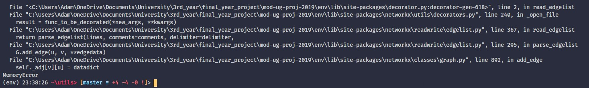

---
header-includes:
	- \usepackage{lineno}
	- \linenumbers
---

# On Parameterized Vertex Cover in Streaming

## Abstract

> The goal of the abstract is to give a complete overview of: the problem you identified, the approach you took/what you produced, your evaluation of it, what it all means.
>
> 250-300 words

With the size of datasets growing in the order of magnitudes, there has been greater demand for techniques to process the data. Streaming algorithms have been shown to be a strong contender in order to tackle this. While these datasets have been growing, many of the classical problems questioned about these datasets have not changed and neither has the order of their output size. This gives us a perfect environment to take advantage of parameterized complexity. Vertex Cover is one such such classical problem that has had parameterized streaming algorithms developed for it in recent years. However, many of these algorithms have not been implemented and tested on real world datasets.

This paper aims to build a base on how to go about implementing streaming algorithms and to provide aids in understanding of how these algorithms work. We provide as-is implementations from previous work as well as optimised implementations, visualisations, performance profiling against graphs from a number of different domains, and a proof-of-concept streaming platform. All together, we believe our work provides all the tools needed to further development in bringing this class of algorithms out of theoretical space.

> needs more about memory parameterization

[TOC]

## Introduction

> Remember your readers, especially your 2nd marker might have no knowledge of the topic of your project. The introduction is your chance to tell them what your project is about. What is the topic of your project? What are the problems? Why is it important? In the introduction you are trying, at a high-level to give the reader an idea of these issues. Convince them that your project is something interesting that's worth working on.
>
> - What is the general problem?
> - Why is it worth working on?
> - Who else as worked on this problem?
> - What did they find?
> - Given this, what is the specific problem you will solve?

> The problem - basically first bit of presentation

Parameterized Vertex Cover in Streaming. That is the problem.

> Vertex Cover
>
> This paper considers the parameterized Vertex Cover problem, abbreviated VC henceforth: given a graph G and a parameter k, decide if G has a vertex cover of at most k vertices. This problem was amongst the first few problems that were shown to be NP-hard [14]. In addition, the problem has been a central problem in the study of parameterized algorithms [11], and has applications in areas such as computational biochemistry and biology [6].

Vertex cover is a classical problem which has found many use cases. Imagine a heavily connected road network in a city. The city council wants to figure out the most cost effective placement of cameras so that they are able to see every road (assume the cameras can see 360$^\circ$). The way of calculating this mathematically would be as a vertex cover of a graph where each intersection was a node and each road between them is an edge. For cities nowadays, this graph can be too big to compute using traditional methods. So we need updated methods to handle this. The city now realises that they only have a certain number of cameras they're able to put up, $k$ cameras. The city decides the project won't be worth the investment if they're not able to cover the entire city. This is now the vertex cover problem. The city doesn't care for any solution that exceeds their budget of $k$ cameras.

Graph Theory as a field of study is about understanding these abstract ideas and then being able to apply them to real life scenarios. A graph is just a model for objects and the relationships between them. This has many more applications than just city road networks, applications have been found in many other physical and social sciences, from quantum field theory to lexical semantics.

> Parameterization?
>
> - Non-parameterized/classical TIME : 1960s
> - parameterized TIME : 1990s
> - Non-parameterized SPACE :2000s
> - parameterized SPACE :2015

Time complexity has been at the forefront of algorithmic research for decades, ever since the discipline took off in the 1960s. At this time, we were more interested in whether a problem was tractable or not than how much memory it would take up. It wasn't until around the turn of the century did research into space complexity work it's way up. This was in time with the rise in size of datasets. We were entering the information age and suddenly space was a factor in whether a computer would be able to run an algorithm or not. Parameterized complexity

> The streaming model

For most people when think think of streaming, video streaming will be the first thought that comes to mind. But Film and TV isn't the only thing that streaming can be used for. Streaming is now quite widely used in the enterprise space for real-time data. Where data is being reported from sensors in a system for use in monitoring. Streaming is also used in many systems for logging purposes. Actions that users make in a system need to be tracked for analytics so whenever they make an action an event log is created and sent to a stream of all the other users' actions. These can be then aggregated very quickly and efficiently to gain actual insight from.

> See references given by Rajesh in relation to the importance of Big Data in view of UK Govt
>
> - https://assets.publishing.service.gov.uk/government/uploads/system/uploads/attachment_data/file/325024/informatics-bigdata.pdf
> - https://data.gov.uk/data/contracts-finder-archive/download/1508537/821e7b57-36d3-4d7a-b8b7-9aa306dbe7c9

---

> My supervisor Rajesh Chitnis had previously been researching the problem of parameterized vertex cover. I found that none of the algorithms he talked about had ever been put into practice, only ever written theoretically.

In the past, streaming algorithms had always interested us but we lacked a specific area to be able to begin learning as the topic is very broad. This is when the area of graph theory was brought to us by our supervisor. This project gave us the platform to be able to spend time learning about streaming algorithms and frameworks.

## Background

### Concepts

For the reader unfamiliar with concepts covered in this paper, an explanation has been provided for each. For those simply unfamiliar with abbreviations, a glossary has been provided.

**Graph Theory**: the study of mathematical structures (graphs) which are used to show pairwise relations between objects.

> Include note further up about this project only considering undirected graphs

**Vertex Cover**: a set of vertices such that each edge of a graph is incident to at least one vertex of the set. The problem of finding a minimum vertex cover (the smallest possible) is a classical optimization problem and is a typical example of an NP-hard problem. The decision version (where we only want a yes/no answer), known as the Vertex Cover Problem, is one of Karp's 21 NP-complete problems. This makes is a very classical problem. Formally, given a graph $G = (V, E)$ and a vertex cover $V'$:
$$
V' \subset V \text{ such that } \forall (u, v) \in E \Rightarrow u \in V' \vee v \in V'
$$
**Parameterized complexity**: A branch of computational complexity theory that focusses on classifying computational problems according to their inherent difficulty with respect to multiple parameters of the input or output. The complexity of the problem is then measured as a function of those parameters. The vertex cover problem is fixed-parameter tractable, meaning that, while it may be NP-complete in terms of the input size only, it is polynomial in the output of a vertex cover size $k$.

**Fixed Parameter Tractable**:

**Parameterized Vertex Cover**: Also known as k-VC, the vertex cover problem is posed as a decision problem in which we are given a graph $G$ and a positive integer $k$ and we must find out whether $G$ has a vertex cover of size at most $k$. The $k$ value can be thought of as a "budget" to spend on the vertex cover. If we are limited but such a budget then we have no reason to consider solutions that exceeds this.

**Streaming Model**:

**Streaming Algorithms**: We now live in a world where data is the most valuable resource. Given such, it's no surprise that we're drowning in it. Datasets have become larger than what we can store on hard drives. The solution is to not store the dataset. Simply stream it as one item at a time. Streaming algorithms have been developed to handle this, being able to gather information while having access to a limited amount of memory.

### Kernelization

Kernelization is a pre-processing method for minimising datasets into their core components known as a "kernel". Processing completed on such a kernel will return the same output as that would be returned had the processing been run on the entire dataset.

A kernelization algorithm for vertex cover was put forward by S. Buss in 1993[citation needed]. Given an input of an undirected graph $G$ and a number $k$, the algorithm works by applying the following rules until no more reductions can be made.

1. If $k > 0$ and $v$ is a vertex of degree $> k$, remove $v$ from the graph and
   decrease $k$ by 1.
2. If $v$ is an isolated vertex, remove it.
3. If more than $k^2$ edges remain in the graph, and neither of the previous two
   rules can be applied, then the graph cannot contain a vertex cover of size
   $k$.

The output is a set of at most $k$ vertices that includes an endpoint of every edge in the graph, if such a set exists, or a failure exception if no such set exists.

> There is a book on Kernelization (https://www.cambridge.org/core/books/kernelization/36F327A8BB97CB6BBEA564368BF1AD4A) that you can refer to. There are more relevant references for both parameterized complexity and streaming in the "Towards a Theory of Parameterized Streaming Algorithms" paper...

### Branching

Trees have been used as a abstract data type in computer science for decades. They provide relatively easy logarithmic complexity, due to the fact that they split their data into $n$ sections recursively, and are simple to understand and implement, leading to them being a core concept in any University introduction-level algorithms course.

Bounded-depth Search Trees provide a parameterized algorithm for vertex cover:


> In this section, we show how to reduce the number of passes to $2^k$ (while still maintaining the same storage) using the technique of bounded-depth search trees (also known as branching). The method of bounded-depth search trees gives a folklore FPT algorithm for k-VC which runs in $2^{O(k)} · n^{O(1)}$ time. The idea is simple: any vertex cover must contain at least one end-point of each edge. We now build a search tree as follows: choose an arbitrary edge, say $e = u − v$ in the graph. Start with the graph $G$ at the root node of the search tree. Branch into two options, viz. choosing either $u$ or $v$ into the vertex cover. The resulting graphs at the two children of the root node are $G − u$ and $G − v$. Continue the branching process. Note that at each step, we branch into two options and we only need to build the search tree to height $k$ for the k-VC problem. Hence, the binary search tree has $2^{O(k)}$ leaf nodes. If the resulting graph at any leaf node is empty (i.e. has no edges) then $G$ has a vertex cover of size $≤ k$ which can be obtained by following the path from the root node to the leaf node in the search tree. Conversely, if the resulting graphs at none of the leaf nodes of the search tree are empty then $G$ does not have a vertex cover of size $≤ k$: this is because at each step we branched on all the (two) possibilities at each node of the search tree.

## Related Work

> - Parameterized Streaming Algorithms for Vertex Cover, 2014
> - Towards a Theory of Parameterized Streaming Algorithms, 2019
>
> 1. **Search** for relevant literature
> 2. **Evaluate** sources
> 3. **Identify** themes, debates and gaps
> 4. **Outline** the structure
> 5. **Write** your literature review
>
> A good literature review doesn’t just summarise sources – it analyses, synthesises, and critically evaluates to give a clear picture of the state of knowledge on the subject.

## Method

> - What are you doing?
> - How are you doing it?
> - Why are you doing it this way?

In researching for this paper, more often than, not we found that, while the core concepts weren't too difficult to get our heads around, the higher level explanations would often go right over our heads.

Our work here covers three areas which we think would increase accessibility into the field.

1. As with any widely adopted algorithm, clear explanation of how the algorithm works in practice is essential. This includes efforts to visualise the algorithms in action. As with most state-of-the-art research it takes many years of studying to even be able to understand what the papers are talking about, let alone being able to understand the pseudocode that is provided.
2. Practical evidence of performance of the algorithms. While Big-O notation is a good indicator of runtime and memory performance, those only refer to average performance which few, if any, datasets will fit. Seeing whether your problem area is suitable to have a specific algorithm applied to it is crucial.
3. Aid in choosing the correct tools. There exist many tools and platforms nowadays for the development of streaming systems. As with many modern tooling, each have their fair share of buzzwords and jargon most are forced to wade through before fully understanding what a tools function even is.

We identified two attributes that mattered most when implementing vertex cover (or any graph-theoretic) algorithm. These two attributes, size and source, each bubble down to two sub-cases.

Size:

- In-memory - The graph is small enough to store within memory. This means that actions can be performed on the graph taking in account the entire graph.
- Out-of-memory - The graph is too large to store within memory in it's entirety. Actions must now be made on small parts of the graph without the knowledge of other parts.

Source:

- Local - One has direct access to the graph, for example, in the form of a file.
- Networked - One does not have direct access, the data is streamed to you in pieces. This may be either due to the size of the data (it being too large to feasibly store) or due to the nature of the data. This nature being that the data could be fragmented across databases and so must be processed in some way to put it all together.

This allows us to break down our aims into three sections based on these attributes. For in-memory sized local graphs (the traditional setting) we're able to provide traditional tools. This includes visualisations and simplified implementations using well-worn graph libraries. We will be using a library called NetworkX[citation needed]. NetworkX provides data structures for graphs with an intuitive API. It also includes a module for drawing graphs with Matplotlib, a Python visualization library that has been around since 2003. In this setting we can simulate streaming by looping through the edges of a graph. This gives us a particular advantage in seeing truly how the algorithms work as we are able to see the entire graph at the same time.

The second section is for out-of-memory sized local graphs. In our original plan, this section didn't exist as we assumed most implementation details would come forward when implementing into a real streaming framework. However, we found that this was too much of a jump so this middle step was envisioned to allow for a true streaming implementation while still being in the familiarity of the core Python libraries. So that's exactly what we'll be doing. Having the graph represented by an edge list stored in a file allows us to read from the file line by line and therefore edge by edge. This is exactly how a streaming application would see the input of a graph. Since the time taken to read from a file is negligible in comparison to any network activity, we will be able to gauge the performance of these algorithms with minimal external variables. This gives us a platform for accurate performance profiling.

The final section is for out-of-memory sized networked graphs. This is what you'd consider to be an actual use case. This is most flexible section, in that, there are many ways of going about it depending on your situation. We're taking this as an opportunity to build a proof-of-concept system that covers the basics. Apache Kafka has shown promise in it's versatility as a streaming platform rather than being tied down to a particular workflow. This allows for our fairly custom implementation of stream processing. Most streaming platforms prioritise parallelisation in their processing which we don't concern ourselves with. Our data source will be external in the sense that it could be replicated to run on a server far, far away but for ease-of-development's sake it will be ran locally.

### The Algorithms

#### Branching - Non-Stream

```python
def vertex_cover_branching(
    graph: Graph, k: int, vertex_cover: set = set()
) -> Optional[set]:
    if graph.number_of_edges() == 0:
        return vertex_cover

    if k == 0:
        return None

    (u, v) = list(graph.edges)[0]

    left_graph = graph.copy()
    left_graph.remove_node(u)
    left_current_vc = vertex_cover.copy()
    left_current_vc.add(u)
    vc_left = vertex_cover_branching(left_graph, k - 1, left_current_vc)

    if vc_left:
        return vc_left

    right_graph = graph.copy()
    right_graph.remove_node(v)
    right_current_vc = vertex_cover.copy()
    right_current_vc.add(v)
    vc_right = vertex_cover_branching(right_graph, k - 1, right_current_vc)
    return vc_right
```

#### Branching - Stream

> Talk about how pseudocode in Rajesh's paper was wrong with a specific worked example of how it doesn't work. Give updated pseudocode.

[Rajesh et al 2019] converted the above branching algorithm into one that was compatible with the streaming model. This algorithm required $O(k\cdot \log n)$ space and $2^k$ passes. We noticed their pseudocode had an error that had not been caught. In their version, if the end of the edge stream ($j$ in their pseudocode) was reached before a depth ($i$ in their pseudocode) of $k$ was reached then the program would presumably throw an exception as there were no more edges to read. This is due to the fact that the check for whether the end of stream had been reached was put outside the inner-most loop. Below is our corrected version.

```pseudocode
while X != ♠ do
	∅, i = 1, j = 1
	while i != k + 1 do
		Let e_j = u − v such that u < v under the ordering φ
		if Both u /∈ S and v /∈ S then
			if X[i] = 0 then S ← S ∪ {u}
			else S ← S ∪ {v}
			i ← i + 1
		j ← j + 1
		if j = m + 1 then Return S and abort
	X ← Dictk(Next(X))
if X = ♠ then Return NO
```

> Whether to put new pseudocode here or in results?

In implementing this algorithm into a streaming platform such as Kafka, we found that the way the pseudo had been structured made implementation difficult. This is due to the fact that Kafka relies on brokers recording whether they have seen a message or not, this is counted as the number of `acks` (acknowledgements). If the algorithm were to exit before acknowledging all the edges in the stream then these edges would lay dormant until another algorithm was run and it would start reading them incorrectly. This caused us to rewrite the algorithm with the inner-most loop being based on looping through the edges rather than looping through the depths of the tree.

```python
for bin_string in _get_binary_strings(job.k):
    vertex_cover: set = set()
    vertex_cover_exists = True
    bin_string_pos = 0

    async for edge in stream_edges:
        if edge.is_end:
            break

        if not vertex_cover_exists:
            continue

        u = edge.u
        v = edge.v

        if u not in vertex_cover and v not in vertex_cover:
            if bin_string_pos == job.k:
                vertex_cover_exists = False
                continue

            edge_sm, edge_bg = (u, v) if u < v else (v, u)

            if bin_string[bin_string_pos] == "0":
                vertex_cover.add(edge_sm)
            else:
                vertex_cover.add(edge_bg)

            bin_string_pos += 1

    if vertex_cover_exists:
        return vertex_cover

    await topic_requests.send(value=GraphRequest(job.path))

return None
```

**Note**: `i = bin_string_pos`, `X = bin_string`.

As you can see the loop through the edges is only broken from once the `is_end` edge is acknowledged.

#### Kernelization - Non-Stream

```python
def vertex_cover_kernelization(graph: Graph, k: int) -> Optional[set]:
    kernel, vertex_cover = _kernelize(graph, k)

    if kernel.number_of_nodes() > k ** 2 + k or kernel.number_of_edges() > k ** 2:
        return None

	pass

def _kernelize(graph: Graph, k: int) -> Tuple[Graph, set]:
    kernel = graph.copy()
    vertex_cover = set()
    reductions_can_be_made = True
    while reductions_can_be_made:
        reduction_made = False
        for node in list(kernel.nodes):
            degree = kernel.degree[node]
            if k > 0 and degree > k:
                reduction_made = True
                kernel.remove_node(node)
                vertex_cover.add(node)
                k -= 1
            elif degree == 0:
                kernel.remove_node(node)

        if not reduction_made:
            reductions_can_be_made = False

    return kernel, vertex_cover
```

#### Kernelization - Stream

```python
def _kernelize(filename: str, k: int) -> Optional[Kernel]:
    with open(filename) as stream:
        no_of_edges = int(stream.readline().split()[1])

        kernel = Kernel(k)
        kernel_exists = True
        for line in stream:
            u, v = line.split()[:2]

            if not kernel.next(u, v):
                kernel_exists = False
                break

        return kernel if kernel_exists else None

class Kernel:
    def __init__(self, k: int):
        self.k = k
        self.matching: Dict[Tuple[Any, Any], Tuple[List[Any], List[Any]]] = {}

    def next(self, u: Any, v: Any) -> bool:
        is_neighbour = False

        matching = self._get_if_in(u, self.matching)
        if matching is not None:
            is_neighbour = True

            matched_edge, neighbours = matching
            vertex_pos = matched_edge.index(u)
            if len(neighbours[vertex_pos]) < self.k:
                neighbours[vertex_pos].append((u, v))

        else:
            matching = self._get_if_in(v, self.matching)
            if matching is not None:
                is_neighbour = True

                matched_edge, neighbours = matching
                vertex_pos = matched_edge.index(v)
                if len(neighbours[vertex_pos]) < self.k:
                    neighbours[vertex_pos].append((u, v))

        if not is_neighbour:
            self.matching[(u, v)] = ([], [])

            if len(self.matching) > self.k:
                return False

        return True
```

### Local - Visualisation

This is the traditional case. The graph is small enough to use in-memory and you have local access to it so you are able to use which ever tools you wish to calculate the vertex cover.

##### NetworkX



In order to aid in the understanding of algorithms, it is often helpful to create visualisations. So I did just that.


### Local-Stream - Performance Profiling

In this case the graph is no longer large enough to store in-memory but you are able to have direct access to it. The graph may be large but it is feasible to store the graph on disk since disk sizes are often many magnitudes larger than that of memory. Traditional algorithms are no longer applicable here, this is the first example where the invention of streaming algorithms is a necessity.

There are a number of ways the above algorithms could be constructed to be made for user friendly and easy to apply to problems.

#### `find_vertex_cover` (branching)

This is simply using the branching algorithm. For the situation where you already know your k value. You may already know this value because you know your memory limits or have a budget.

#### `find-kernel` (kernelization)

This is simply using the kernelization algorithm. Shrinking a given input down to it's most important core.

#### `find_vertex_cover_efficient` (kernelization-branching)

This combines the algorithms using the kernelized graph and passing that into the branching algorithm.

#### `find_min_vertex_cover` (branching-min)

This uses the branching algorithm in a binary search to find the minimum size a vertex cover could be.

#### `find_min_vertex_cover_efficient` (kernelization--branching-min)

This then combines the previous two for a complete solution to find a minimum vertex cover for a given stream.

#### Datasets

Eventually you get to a point when the datasets become too large to even read.


Visual Studio Code, a more modern text editor, is able to open the file however not without performance issues even when wrapping and folding have been turned off.


There is even a limit for Visual Studio Code though.


#### Testing and Comparison

We don't live in a world anymore where we have to hack our way around machines to push the limits of their memory just so we can play some games. We haven't for a while. This goes the same for algorithms. Most of the time, we will happily sacrifice memory efficiency for any extra pittance of time efficiency. Memory is is dispensable, our time is not. This may still be true for streaming algorithms, but only to an extent. We are very much interested in both time and space complexity here. And so, we need to test as such.

Testing will be carried out across all three domains. Each will be tested against the same set of datasets which will include graphs from a variety of sources. Some synthetic, some constructed, some realistic. Varying in densities. It is important to account for these factors in our datasets as input size isn't the only thing that affects graph algorithms.

Measuring runtime will be handled by Python's  `time.perf_counter_ns` which is a clock designed for performance testing; it being monotonic and ~~SOMETHING ELSE~~. Memory will be measure through a python memory profiler called `memory-profiler`.  Each domain, algorithm, and dataset will be run through both a number of times to achieve a result ~~hopefully~~ devoid of inconsistencies.

### Stream - Proof-of-Concept

This is the main case. In a typical situation, knowledge of the graph's attributes will be limited so it should be treated as a unbounded stream (a stream that has no end). The opposite of this would be treating it as a bounded stream, where we know there is an end to the stream.

##### Batch vs Stream processing

Most "streaming" applications work on **unbounded** streams. These are data streams which are essentially infinite. Examples include: sensor readings and application logging. In these cases, the objective is not to obtain a final result but to aggregate the data before storing it for future use. This would be classed as **stream processing**.

Our problem of Vertex Cover would be classed as **batch processing**. We may be working on a data stream but once either algorithm has completed we won't need to run it again.

Most streaming platforms (especially those in the Apache line up) work on unbounded stream processing. So finding a streaming platform appropriate for batch processing was a little more tricky. There are a number of "graph" processing frameworks.

> To build a streaming data pipeline, we'll need a few tools.
>
> First, you’ll require an in-memory framework (such as Spark), which handles batch, real-time analytics, and data processing workloads. You’ll also need a streaming platform (Kafka is a popular choice, but there are others on the market) to build the streaming data pipeline. In addition, you’ll also need a NoSQL database (many people use HBase, but you have a variety of choices available).
>
> Step three is to fetch the data from the streaming platform. Next, we'll process the data. The fifth step is to manage the pipeline to ensure everything is working as it’s supposed to.

Streaming platforms are the base on which a data stream is sent and received. Examples include:

- Apache Kafka
- Amazon Kinesis
- Apache Spark Streaming
- Google Cloud Pub/Sub
- Google Cloud DataFlow
- RabbitMQ

Once we have the platform we need an in-memory framework to handle the processing of each item in the stream. This is where the algorithms will actually run. There are a whole number of frameworks for this, all of which have their own niche use cases. Examples include:

- Apache Spark
- Apache Spark GraphX
- Apache Flink
- Apache Beam
- Apache Samza

##### Kafka and Faust

##### In-memory-sized stream graphs

If you know beforehand the size of the graph and it's of an in-memory size then you don't need to go through the hassle of treating it as a stream. One pass through the graph will allow you to store the graph locally and therefore be able to use it as a local graph instead.

## Results

> - What have you done?
> - What went into it?
> - Why have you done things the way you have done them?

### Visualisation

### Profiling

#### Runtime Analysis

| Problem                       | Time Complexity | Local |
| ----------------------------- | --------------- | ----- |
| `find_vertex_cover`           | $O()$           |       |
| `does_vertex_cover_exist`     |                 |       |
| `find_vertex_cover_efficient` |                 |       |
| `find_min_vertex_cover_size`  |                 |       |
| `find_min_vertex_cover`       |                 |       |

`Insert graph here`

#### Memory profiling

| Problem                       | Local | Local-Stream | Stream |
| ----------------------------- | ----- | ------------ | ------ |
| `find_vertex_cover`           |       |              |        |
| `does_vertex_cover_exist`     |       |              |        |
| `find_vertex_cover_efficient` |       |              |        |
| `find_min_vertex_cover_size`  |       |              |        |
| `find_min_vertex_cover`       |       |              |        |

`Insert graph here`

### Algorithm Comparison

Since we have two viable solutions for finding the vertex cover for a given graph stream and value $k$, `find_vertex_cover` and `find_vertex_cover_efficient` it would be a good idea to compare them.

#### Runtime Analysis

| Graph | Nodes | Edges | Density | `branching` | `kernel-branching` |
| ----- | ----- | ----- | ------- | ----------- | ------------------ |
|       |       |       |         |             |                    |
|       |       |       |         |             |                    |

`Insert graph here`

### Stream Implementation

## Discussion

> - Discuss things

## Evaluation

> - Did your idea work?
> - How did you test it?
> - What would you do differently?

If I had more time I would look into

- expanding the proof-of-concept into a full platform
- expanding it to more algorithms
- how the algorithms can be parallelized for greater performance

## Conclusion

> To finish up your report you’ll have a conclusion, your references and then your appendices. Your conclusions should be something of a mirror of the introduction. Remind the reader of what you did and what you found. What are the final ‘takeaways’ from your work? The project as a whole.
