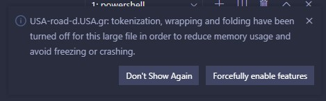

---
header-includes:
    - \usepackage{lineno}
    - \linenumbers
---

# On Parameterized Vertex Cover in Streaming

## Abstract

> The goal of the abstract is to give a complete overview of: the problem you identified, the approach you took/what you produced, your evaluation of it, what it all means.
>
> 250-300 words

With the size of datasets growing in the order of magnitudes, there has been a greater demand for techniques to process the data. Streaming algorithms have been shown to be a strong contender in order to tackle this. While these datasets have been growing, many of the classical problems questioned about these datasets have not changed and neither has the order of their output size. This gives us a perfect environment to take advantage of parameterized complexity. Vertex Cover is one such classical problem that has had parameterized streaming algorithms developed for it in recent years. Yet, many of these algorithms have not been implemented and tested on real-world datasets.

This paper aims to build a base on how to go about implementing streaming algorithms and to provide aids in the understanding of how these algorithms work. We provide as-is implementations from previous work as well as optimised implementations, visualisations, performance profiling, and a proof-of-concept streaming platform. All together, we believe our work provides all the tools needed to further development in this class of algorithms.

[TOC]

## Introduction

> Remember your readers, especially your 2nd marker might have no knowledge of the topic of your project. The introduction is your chance to tell them what your project is about. What is the topic of your project? What are the problems? Why is it important? In the introduction you are trying, at a high-level to give the reader an idea of these issues. Convince them that your project is something interesting that's worth working on.
>
> - What is the general problem?
> - Why is it worth working on?
> - Who else as worked on this problem?
> - What did they find?
> - Given this, what is the specific problem you will solve?

### Vertex Cover

> This paper considers the parameterized Vertex Cover problem, abbreviated VC henceforth: given a graph G and a parameter k, decide if G has a vertex cover of at most k vertices. This problem was amongst the first few problems that were shown to be NP-hard [14]. In addition, the problem has been a central problem in the study of parameterized algorithms [11], and has applications in areas such as computational biochemistry and biology [6].

Vertex cover is a classical graph-theoretic problem. The decision version was one of Karp's 21 NP-complete problems[citation needed].

Imagine a heavily connected road network in a city. The city council wants to figure out the most cost-effective placement of cameras so that they are able to see every road (assume the cameras can see 360$^\circ$). The way of calculating this mathematically would be as a vertex cover of a graph where each intersection was a node and each road between them is an edge. For cities nowadays, this graph can be too big to compute using traditional methods. So we need updated methods to handle this. The city now realises that they only have a certain number of cameras they're able to put up, $k$ cameras. The city decides the project won't be worth the investment if they're not able to cover the entire city. This is now the vertex cover problem. The city doesn't care for any solution that exceeds their budget of $k$ cameras.

Graph Theory as a field of study is about understanding these abstract ideas and then being able to apply them to real-life scenarios. A graph is a model for objects and the relationships between them. This has many more applications than city road networks, applications have been found in many other physical and social sciences, from quantum field theory[citation needed] to lexical semantics[citation needed]

### Parameterized Complexity

> - Non-parameterized/classical TIME : 1960s
>- parameterized TIME : 1990s
> - Non-parameterized SPACE :2000s
> - parameterized SPACE :2015

Time complexity has been at the forefront of algorithmic research for decades, ever since the discipline took off in the 1960s. At this time, we were more interested in whether a problem was tractable or not than how much memory it would take up. It wasn't until around the turn of the century did research into space complexity work it's way up. This was in time with the rise in the size of datasets. We were entering the information age and suddenly space was a factor in whether a computer would be able to run an algorithm or not. Parameterized complexity thus gained traction in research.

The theory of parameterized (time) complexity was first developed in the 90s by Downey and Fellows[citation needed].

Quote from their paper

Most of this research has been focused on time complexity which has allowed us to run typically intractable problems in a way that limits their runtime to make them tractable. Now research has started on parameterized memory complexity. This aids us in algorithms with typically intractable memory usage, no matter the runtime. Introducing a parameter to limit their memory usage by allows us to run algorithms based on our maximum memory budget and thus run them at the limits what is possible on our current machines.

Some bit on FPT algorithms

### Big Data and Streaming

For most people when think of streaming, video streaming will be the first thought that comes to mind. But Film and TV isn't the only thing that streaming can be used for. Streaming is now quite widely used in the enterprise space for real-time data. Where data is being reported from sensors in a system for use in monitoring. Streaming is also used in many systems for logging purposes. Actions that users make in a system need to be tracked for analytics so whenever they make an action an event log is created and sent to a stream of all the other users' actions. These can be then aggregated very quickly and efficiently to gain actual insight from.

We now live in a world where data is the most valuable resource. Given such, it's no surprise that we're drowning in it. Datasets have become larger than what we can store on hard drives. The solution is to not store the dataset. Simply stream it as one item at a time. Streaming algorithms have been developed to handle this, being able to gather information while having access to a limited amount of memory.

In 2014, the UK Government identified Big Data as one of "eight great technologies which will propel the UK to future growth"[citation needed]. Research into Big Data is therefore necessary to facilitate this growth.

### Aims

Our work here focuses on two algorithms developed by Rajesh Chitnis et al: a branching method for solving VC($k$)[citation needed] and a kernelization method[citation needed]. The branching method is built on a traditional non-stream method for solving VC($k$) while the kernelization technique is entirely novel. These techniques are designed for non-dynamic undirected graph streams.

Our main aim is to create a foundation for further work to be built upon. We identify three areas which would increase accessibility into the field.

1. As with any widely adopted algorithm, a clear explanation of how the algorithm works in practice is essential. This includes efforts to visualise the algorithms in action. As with most state-of-the-art research it takes many years of studying to even be able to understand what the papers are talking about, let alone being able to understand the pseudocode that is provided.
2. Practical evidence of the performance of the algorithms. While Big-O notation is a good indicator of runtime and memory performance, those only refer to average performance which few, if any, datasets will fit. Seeing whether your problem area is suitable to have a specific algorithm applied to it is crucial.
3. Aid in choosing the correct tools. There exist many tools and platforms nowadays for the development of streaming systems. As with many modern tooling, each have their fair share of buzzwords and jargon most are forced to wade through before fully understanding what a tool's function even is.

> My supervisor Rajesh Chitnis had previously been researching the problem of parameterized vertex cover. I found that none of the algorithms he talked about had ever been put into practice, only ever written theoretically.

In the past, streaming algorithms had always interested us but we lacked a specific area to be able to begin learning as the topic is very broad. This is when the area of graph theory was brought to us by our supervisor. This project gave us the platform to be able to spend time learning about streaming algorithms and frameworks.

## Background

For the reader unfamiliar with concepts covered in this paper, an explanation has been provided for each. For those simply unfamiliar with abbreviations, a glossary has been provided.

**Graph Theory**: The study of mathematical structures (graphs) which are used to show pairwise relations between objects.

**Vertex Cover**: A set of vertices such that each edge of a graph is incident to at least one vertex of the set. The problem of finding a minimum vertex cover (the smallest possible) is a classical optimization problem and is a typical example of an NP-hard problem. The decision version (where we only want a yes/no answer) is known as the Vertex Cover Problem. Formally, given a graph $G = (V, E)$ and a vertex cover $V'$:
$$
V' \subset V \text{ such that } \forall (u, v) \in E \Rightarrow u \in V' \vee v \in V'
$$
**Maximal Matching**:

**Parameterized complexity**: A branch of computational complexity theory that focusses on classifying computational problems according to their inherent difficulty with respect to multiple parameters of the input or output. The complexity of the problem is then measured as a function of those parameters. The vertex cover problem is fixed-parameter tractable, meaning that, while it may be NP-complete in terms of the input size only, it is polynomial in the output of a vertex cover size $k$.

**Fixed-Parameter Tractable** (FPT): A subset of parameterized problems, those that can be solved by algorithms that are exponential only in the size of the parameter but polynomial in the size of the input. These algorithms allow for efficient solving for small values of the fixed parameter.

**Parameterized Vertex Cover**: Also known as k-VC, the vertex cover problem is posed as a decision problem in which we are given a graph $G$ and a positive integer $k$ and we must find out whether $G$ has a vertex cover of size at most $k$. The $k$ value can be thought of as a "budget" to spend on the vertex cover. If we are limited but such a budget then we have no reason to consider solutions that exceeds this.

**Streaming Algorithm**: An algorithm designed for processing either a bounded or unbounded data stream. Bounded streams may be replayed with either a fixed or random order. Unbounded streams are typically used for aggregation of data.

**Streaming Model**: The stream is split into blocks of data

**Kernelization**: Kernelization is a pre-processing method for minimising datasets into their core components known as a kernel. Processing completed on such a kernel will return the same output as that would be returned had the processing been run on the entire dataset.

> There is a book on Kernelization (https://www.cambridge.org/core/books/kernelization/36F327A8BB97CB6BBEA564368BF1AD4A) that you can refer to.
> There are more relevant references for both parameterized complexity and streaming in the "Towards a Theory of Parameterized Streaming Algorithms" paper...

**Branching**: Trees have been used as an abstract data type in computer science for decades. They provide relatively easy logarithmic complexity, due to the fact that they split their data into $n$ sections recursively, and are simple to understand and implement, leading to them being a core concept in any University introduction-level algorithms course.

> In this section, we show how to reduce the number of passes to $2^k$ (while still maintaining the same storage) using the technique of bounded-depth search trees (also known as branching). The method of bounded-depth search trees gives a folklore FPT algorithm for k-VC which runs in $2^{O(k)} · n^{O(1)}$ time. The idea is simple: any vertex cover must contain at least one end-point of each edge. We now build a search tree as follows: choose an arbitrary edge, say $e = u − v$ in the graph. Start with the graph $G$ at the root node of the search tree. Branch into two options, viz. choosing either $u$ or $v$ into the vertex cover. The resulting graphs at the two children of the root node are $G − u$ and $G − v$. Continue the branching process. Note that at each step, we branch into two options and we only need to build the search tree to height $k$ for the k-VC problem. Hence, the binary search tree has $2^{O(k)}$ leaf nodes. If the resulting graph at any leaf node is empty (i.e. has no edges) then $G$ has a vertex cover of size $≤ k$ which can be obtained by following the path from the root node to the leaf node in the search tree. Conversely, if the resulting graphs at none of the leaf nodes of the search tree are empty then $G$ does not have a vertex cover of size $≤ k$: this is because at each step we branched on all the (two) possibilities at each node of the search tree.

## Related Work

> - Parameterized Streaming Algorithms for Vertex Cover, 2014
> - Towards a Theory of Parameterized Streaming Algorithms, 2019
>
> 1. **Search** for relevant literature
> 2. **Evaluate** sources
> 3. **Identify** themes, debates and gaps
> 4. **Outline** the structure
> 5. **Write** your literature review
>
> A good literature review doesn’t just summarise sources – it analyses, synthesises, and critically evaluates to give a clear picture of the state of knowledge on the subject.

## Method

> - What are you doing?
> - How are you doing it?
> - Why are you doing it this way?

In researching for this paper, more often than, not we found that, while the core concepts weren't too difficult to get our heads around, the higher-level explanations would often go right over our heads.

We identified two attributes that mattered most when implementing vertex cover (or any graph-theoretic) algorithm. These two attributes, size and source, each bubble down to two sub-cases.

Size:

- In-memory - The graph is small enough to store within memory. This means that actions can be performed on the graph taking in account the entire graph.
- Out-of-memory - The graph is too large to store within memory in it's entirety. Actions must now be made on small parts of the graph without the knowledge of other parts.

Source:

- Local - One has direct access to the graph, for example, in the form of a file.
- Networked - One does not have direct access, the data is streamed to you in pieces. This may be either due to the size of the data (it being too large to feasibly store) or due to the nature of the data. This nature being that the data could be fragmented across databases and so must be processed in some way to put it all together.

This allows us to break down our aims into three sections based on these attributes. For in-memory sized local graphs (the traditional setting) we're able to provide traditional tools. This includes visualisations and simplified implementations using well-worn graph libraries. In this setting we can simulate streaming by looping through the edges of a graph. This gives us a particular advantage in seeing truly how the algorithms work as we are able to see the entire graph at the same time.

The second section is for out-of-memory sized local graphs. In our original plan, this section didn't exist as we assumed most implementation details would come forward when implementing into a real streaming framework. However, we found that this was too much of a jump so this middle step was envisioned to allow for a true streaming implementation while still being in the familiarity of the core Python libraries. So that's exactly what we'll be doing. Having the graph represented by an edge list stored in a file allows us to read from the file line by line and therefore edge by edge. This is exactly how a streaming application would see the input of a graph. Since the time taken to read from a file is negligible in comparison to any network activity, we will be able to gauge the performance of these algorithms with minimal external variables. This gives us a platform for accurate performance profiling.

The final section is for out-of-memory sized networked graphs. This is what you'd consider to be an actual use case. This is the most flexible section, in that, there are many ways of going about it depending on your situation. We're taking this as an opportunity to build a proof-of-concept system that covers the basics. Apache Kafka has shown promise in it's versatility as a streaming platform rather than being tied down to a particular workflow. This allows for our fairly custom implementation of stream processing. Most streaming platforms prioritise parallelisation in their processing which we don't concern ourselves with. Our data source will be external in the sense that it could be replicated to run on a server far, far away but for ease of development sake it will be ran locally.

### The Algorithms

The following covers the algorithms that we will be implementing to solve VC($k$).

#### Branching - Classical

Bounded Search Trees have been used to solve many parameterized problems due to their bounded nature. Starting with the whole graph, this version works by recursively branching on each edge, deleting a chosen vertex along the way. If you have an empty graph before you reach a depth of $k$ then you will have your vertex cover. If not, then you simply try every other path down the tree, choosing a different set of vertices on each path. If none of the paths work out then you can conclude that no vertex cover exists with a maximum size of $k$.


```python
def vertex_cover_branching(
    graph: Graph, k: int, vertex_cover: set = set()
) -> Optional[set]:
    if graph.number_of_edges() == 0:
        return vertex_cover

    if k == 0:
        return None

    (u, v) = list(graph.edges)[0]

    left_graph = graph.copy()
    left_graph.remove_node(u)
    left_current_vc = vertex_cover.copy()
    left_current_vc.add(u)
    vc_left = vertex_cover_branching(left_graph, k - 1, left_current_vc)

    if vc_left:
        return vc_left

    right_graph = graph.copy()
    right_graph.remove_node(v)
    right_current_vc = vertex_cover.copy()
    right_current_vc.add(v)
    vc_right = vertex_cover_branching(right_graph, k - 1, right_current_vc)
    return vc_right
```

Being a search tree, it is noted that this algorithm can be tweaked to be a breadth-first search rather than depth-first. This will prioritise the search for a minimum vertex cover which may be more useful in some situations.

#### Branching - Stream

> Talk about how pseudocode in Rajesh's paper was wrong with a specific worked example of how it doesn't work. Give updated pseudocode.

Rajesh et al 2019[citation needed] converted the above branching algorithm into one that was compatible with the streaming model. This algorithm required $O(k\cdot \log n)$ space and $2^k$ passes. We noticed their pseudocode had an error. In their version, if the end of the edge stream ($j$ in their pseudocode) was reached before a depth ($i$ in their pseudocode) of $k$ was reached then the program would presumably throw an exception as there were no more edges to read. This is due to the fact that the check for whether the end of stream had been reached was put outside the inner-most loop. Below is our corrected version.

```pseudocode
while X != ♠ do
    S = ∅, i = 1, j = 1
    while i != k + 1 do
        Let e_j = u − v such that u < v under the ordering φ
        if Both u /∈ S and v /∈ S then
            if X[i] = 0 then S ← S ∪ {u}
            else S ← S ∪ {v}
            i ← i + 1
        j ← j + 1
        if j = m + 1 then Return S and abort
    X ← Dictk(Next(X))
if X = ♠ then Return NO
```

In implementing this algorithm, we found that the way the pseudocode had been structured made implementation difficult. This is because streaming platforms such as Kafka rely on brokers recording whether they have seen a message or not; this is counted as the number of `acks` (acknowledgements). If the algorithm were to exit before acknowledging all the edges in the stream, then these edges would lay dormant until another algorithm was run and it would start reading them erroneously. This caused us to rewrite the algorithm with the inner-most loop being based on looping through the edges rather than looping through the depths of the tree.

change this explanation a little to take out kafka

```pseudocode
while X != ♠ do
    ∅, i = 0, j = 0
    while j != m do
        if i > k then continue
        Let e_j = u − v such that u < v under the ordering φ
        if Both u /∈ S and v /∈ S then
            if i == k then i ← i + 1 and continue
            if X[i] = 0 then S ← S ∪ {u}
            else S ← S ∪ {v}
            i ← i + 1
        j ← j + 1
    if i < k then Return S and abort
    X ← Dictk(Next(X))
if X = ♠ then Return NO
```

#### Kernelization - Classical

First devised by Buss[citation needed], given an input of an undirected graph $G$ and a number $k$, this algorithm works by applying the following rules until no more reductions can be made.

1. If $k > 0$ and $v$ is a vertex of degree $> k$, remove $v$ from the graph and
   decrease the value of $k$ by 1.
2. If $v$ is an isolated vertex, remove it.
3. If more than $k^2$ ~~edges remain in the graph, and neither of the previous two
   rules can be applied, then the graph cannot contain a vertex cover of size
   $k$.~~ reword this

reword this

~~The output is a set of at most $k$ vertices that includes an endpoint of every edge in the graph, if such a set exists, or a failure exception if no such set exists.~~ This is the first $\mathcal{O}(k^2)$ vertices kernel. This was then improved upon in Balasubramanian[citation needed] but for the sake of this paper we will be using the simpler Buss kernelization algorithm.

```pseudocode
vertex_cover ← ∅
while True
    reduction ← False
    foreach node in graph.nodes
        if k > 0 and node.degree > k:
            reduction ← True
            graph ← graph - node
            vertex_cover ← vertex_cover ∪ {node}
            k ← k - 1
        else if node.degree = 0
            reduction ← True
            graph ← graph - node

    if reduction = False
        break

if kernel.number_of_edges() > k^2:
    return null

return graph
```

#### Kernelization - Stream

Rajesh et al 2015[citation needed] developed this algorithm. It works by greedily maintaining a maximal matching and for each matched vertex $v$, keeping up to k edges incident on $v$. If at any point the number of matched edges exceeds $k$ then we can conclude no such vertex cover exists of size $\leq k$ and end the stream. If we reach the end of the stream then a kernel consisting of all the matched edges and their neighbours is returned. The space complexity of this algorithm is $O(k^2)$.

```pseudocode
kernel = Kernel(k)
kernel_exists = True
maximal_matching = {}
for u, v in stream
    is_neighbour = False
    if u is in maximal_matching
        is_neighbour = True
        matched_edge, neighbours = maximal_matching.get_match(u)
        vertex_pos = matched_edge.index(u)
        if len(neighbours[vertex_pos]) < k
            neighbours[vertex_pos].append((u, v))

    else if v is in maximal_matching
        is_neighbour = True
        matched_edge, neighbours = maximal_matching.get_match(v)
        vertex_pos = matched_edge.index(v)
        if len(neighbours[vertex_pos]) < self.k
            neighbours[vertex_pos].append((u, v))

    if not is_neighbour
        maximal_matching.add((u, v))

        if len(maximal_matching) > k
            return null

return kernel
```

### Local - Visualisation

This is the traditional case. The graph is small enough to use in-memory and you have local access to it so you are able to use which ever tools you wish to calculate the vertex cover. We will be using a library called NetworkX[citation needed]. NetworkX provides data structures for graphs with an intuitive API. It also includes a module for drawing graphs with Matplotlib[citation needed], a Python visualization library that has been around since 2003. With these tools we will be able to create programs that create visualisations of both the kernelization and branching stream algorithms.

There are some key aspects we'd like to highlight in both algorithms. For the kernelization algorithm, these include being able to compare the kernel to the whole graph and being able to see when edges are not added to the kernel. For the branching algorithm, these include the binary string and the binary search tree.

### Local-Stream - Performance Benchmarking

In this case the graph is no longer large enough to store in-memory but you are able to have direct access to it. The graph may be large but it is feasible to store the graph on disk since disk sizes are often many magnitudes larger than that of memory. Traditional algorithms are no longer applicable here, this is the first example where the invention of streaming algorithms is a necessity.

#### Datasets

While the original intention for this section of the project was to test against large graphs from all possible backgrounds (constructed/synthetic/real), we quickly realised that many, if not all, graphs we considered were of the same shape/form. That is, they all had relatively uniform density and so had a minimum vertex cover close to the number of vertices. In order to get any results that was anything more than a null result, we would have to generate some graphs of our own. These graphs would have to have a large number of edges while simultaneously having a low vertex cover number. This leads to graphs with a low level of connectivity.

Eventually you get to a point when the datasets become too large to even read.


Visual Studio Code, a more modern text editor, is able to open the file however not without performance issues even when wrapping and folding have been turned off.



There is even a limit for Visual Studio Code though.


#### Testing and Comparison

> We don't live in a world anymore where we have to hack our way around machines to push the limits of their memory just so we can play some games. We haven't for a while. This goes the same for algorithms. Most of the time, we will happily sacrifice memory efficiency for any extra pittance of time efficiency. Memory is dispensable, our time is not. This may still be true for streaming algorithms, but only to an extent. We are very much interested in both time and space complexity here. And so, we need to test as such.

For memory profiling, we will use the Python package `memory-profiler` which records memory usage at intervals of $0.1\text{s}$. It also allows for tagging of functions meaning that we can see when each function starts and ends. Creating a script to run both the local and stream versions of each algorithm allowed us to show the memory usage of each side by side.

For runtime analysis, we will use a Python package called `pyperf`. It includes tools for writing, running, and analysing runtime benchmarks. By creating a script to run through a handful of graphs and $k$ values and run them with both the local and stream versions of each algorithm, we should be able to paint a clearer picture of how the stream versions compare to their local counterparts.

### Stream - Proof-of-Concept

This is the main case. In a typical situation, knowledge of the graph's attributes will be limited so it should be treated as an unbounded stream (a stream that has no end). The opposite of this would be treating it as a bounded stream, where we know there is an end to the stream.

#### Batch vs Stream processing

Most "streaming" applications work on **unbounded** streams. These are data streams which are essentially infinite. Examples include: sensor readings and application logging. In these cases, the objective is not to obtain a final result but to aggregate the data before storing it for future use. This would be classed as **stream processing**.

Our problem of Vertex Cover would be classed as **batch processing**. We may be working on a data stream but once either algorithm has completed we won't need to run it again.

Most streaming platforms (especially those in the Apache line up) work on unbounded stream processing. So finding a streaming platform appropriate for batch processing was a little more tricky. There are a number of "graph" processing frameworks.

> To build a streaming data pipeline, we'll need a few tools.
>
> First, you’ll require an in-memory framework (such as Spark), which handles batch, real-time analytics, and data processing workloads. You’ll also need a streaming platform (Kafka is a popular choice, but there are others on the market) to build the streaming data pipeline. In addition, you’ll also need a NoSQL database (many people use HBase, but you have a variety of choices available).
>
> Step three is to fetch the data from the streaming platform. Next, we'll process the data. The fifth step is to manage the pipeline to ensure everything is working as it’s supposed to.

Streaming platforms are the base on which a data stream is sent and received. Examples include:

- Apache Kafka
- Amazon Kinesis
- Apache Spark Streaming
- Google Cloud Pub/Sub
- Google Cloud DataFlow
- RabbitMQ

Once we have the platform we need an in-memory framework to handle the processing of each item in the stream. This is where the algorithms will actually run. There are a whole number of frameworks for this, all of which have their own niche use cases. Examples include:

- Apache Spark
- Apache Spark GraphX
- Apache Flink
- Apache Beam
- Apache Samza

#### In-memory-sized stream graphs

If you know beforehand the size of the graph and it's of an in-memory size then you don't need to go through the hassle of treating it as a stream. One pass through the graph will allow you to store the graph locally and therefore be able to use it as a local graph instead.

#### Actors

- producer - explain role and abstract interface
-

## Results

> - What have you done?
> - What went into it?
> - Why have you done things the way you have done them?

### Visualisation

We were able to develop command-line programs to show both the kernelization and branching algorithms working in real-time. Obviously, the speed of the algorithms have been slowed to allow for the user to understand what's happening at each step. Both programs take a  path to an edge list file and a $k$ value as command-line arguments so visualisations can be produced of different graphs at different $k$ values. This gives the ability to see how a kernel of a graph changes depending on the value of $k$.

Naturally, there is a limit to the size of the graph being displayed. On top of having the entire graph in memory and the memory required for running each algorithm, memory is also needed for rendering the image for each frame.


#### Kernelization

Being the visually more interesting and intricate algorithm, it made sense for us to focus our effort on the kernelization algorithm. In [Figure], you can see that we have split the plot into two. On the left side we show the entire graph, marking which vertices and edges have been added to the kernel as well as which edge of the graph is currently being processed. A subtitle shows totals of the number of nodes and edges in the graph. On the right we show the kernel being built up as the algorithm progresses. All vertices and edges of the kernel exist in the same position as they do in the graph so it is easy to see how the kernel resembles the core components of the whole graph once enough vertices have been added to the kernel. Red mark those vertices and edges that are part of the maximal matching the kernelization algorithm maintains. Black marks the neighbours of each matched vertex. A subtitle also shows information relating to the kernel at each step as well as how the kernel relates to the graph in terms of its size.

bit about graph drawing?


While the method we chose in Matplotlib for creating live demonstrations was rather crude, Matplotlib does include classes to create animations with that are able to then be exported into video formats. Using this, we ported over the code used to generate the live demonstration into a new program that creates videos exported to whichever format is specified. This allows for easy sharing of GIFs showing the kernelization in practice.

#### Branching

The branching algorithm is much simpler visually. We created a live demonstration that shows the search tree and the depth-first search being applied to it. The yellow vertex marks the current vertex cover configuration being tested and a boldened trail of edges shows the current path being taken. The binary string being used for the path is shown towards the top left as well as an underscore under the current binary value. Below that is the current edge of the stream. A subtitle shows the current depth and edge index.


It should be noted that, due to the exponential nature of trees, a $k$ value of 10 or more will take significantly longer to load. So, it is advised to only use the visualisation for $k$ values smaller than this. From the [Figure] you can see that already at $k=6$, the bottom line of vertices is getting cramped for space.

### Performance Benchmarking

#### Memory profiling

Nothing here surprised us but it's always nice to be able to see the truth laid out in front of you.

##### Kernelization


##### Branching


#### Runtime Analysis

##### Kernelization


##### Branching

Due to the branching algorithm having a runtime of $O(2^k)$, it quickly became clear that we weren't going to be able to gather as much data as we had initially wanted.


### Proof-of-Concept Implementation

We built a graph streaming platform on top of Faust and Apache Kafka. Faust is a Python stream processing library for use with Kafka. The platform consists of one Faust instance serving as both the processor performing the algorithms and a web server, and a second Faust instance serving as the source of the graph stream. The web server serves a front end to clients shown in [Figure]. From here users are able to create processing jobs by selecting the algorithm, graph, and a $k$ value from the top left box. On submission of a job, the middle column shows the stream  log of edges down the middle column and, on completion, the right column displays a log of results of each job. In early iterations of the system, logging every edge from the incoming stream would freeze the entire site until the stream was finished. Due to this, the stream log has been throttled in the number of updates it is allowed to display per second and so should not be used as a true log as some edges from the stream will be skipped. It has been left there as a visual cue that an algorithm is running, plus it's interesting to see the data being processed.


The front end is built with HTML/CSS/JS and uses Server-Sent Events (SSE) for the transmission of the stream and result logs. Originally, we had considered using WebSockets as the communication is bi-directional between the client and server but this introduced complexity in sorting through the different message types (job submission/stream log/results log). It was deemed SSE was the better option for the two logs and then a HTTP POST request could be used for the job submission.

As this is a proof-of-concept, the second Faust instance was built purely for development purposes. Once a graph is requested, it streams the edge list from a file and then relays that into a Kafka topic. In the development environment, it is run locally but, because it's built with Kafka, can be setup over a network for a more typical production environment.

Kafka is platform agnostic in terms of the connections it allows since it only facilitates the messaging between connections. This means that many different data sources can be used, from databases to web crawlers.

#### Control Flow

We have three actors present in our system:

- App (Client) - The browser client of the user
- App (Server) - The web server serving pages to the user and processing the algorithms
- Producer - The "external" server as the source of the stream of graph edges

For the kernelization algorithm the control flow is shown in [Figure]. The protocol used to communicate between each actor is shown as a note covering between them.


The branching algorithm requires a slightly different sequence of events due to the fact that it is a multi-pass algorithm. The sequence is shown in [Figure]. As shown, some extra coordination is required for the Server to request the graph to be streamed again by the Producer.


## Evaluation

> - Did your idea work?
> - How did you test it?
> - What would you do differently?

Overall, we consider our work a success

### Visualisation

We were able to create two programs that show how each algorithm works step by step. Visually, we find them interesting because it's always nice to see things being built up piece by piece.

add some nicer bits before tearing myself apart

As for the educational factor, whether they act as adequate aids in learning how each algorithm works, remains to be seen. If a student were to look at the visualisation before knowing how the algorithm behind worked then they would most likely struggle to gain any information from it. If used as a part of the learning process, we believe they could be invaluable in connecting the theory with students' representation they have constructed in their minds. This could be improved upon to take up a larger portion of the learning process. Using NetworkX and Matplotlib allowed for convenient code copied over from implementations but lacked features such as interactivity and a storyline for students to follow to guide their understanding of each algorithm. Command-line programs, even with extensive documentation, are inherently less user-friendly than, say, a web page. Considering this, if we were to take a second shot at this task, we would probably attempt to create a web-based educational experience. A JavaScript library such as D3.js[citation needed] would give the flexibility to both accurately visualise the algorithm and allow the user to play around with values and the graph live in their browser. The page would be able to lead the student through how the algorithm works step by step and finish with the visualisation.

### Benchmarking


- allow more time to get better results
- expand testing to graphs from different domains

### Stream Implementation

The stream implementation served as a great introduction for us into the world of streaming frameworks, so, for that alone, we think it served its purpose. As a system, we believe the architecture is cleanly built and can be used as a starting point of anyone building a stream processor using Kafka.

The results shown on the front end are presented in a table drawn using box-drawing characters. This is passed as a string from the server where it is generated. It was done this way for simplicity sake however doesn't allow for much flexibility. Along with how the results are displayed, the results themselves are lacking in information. In a system where jobs could be running for days at a time, it would be useful to have progress logging as well as, on completion, details relating to the job itself. This could include things like runtime and memory usage. The system as a whole could be expanded in terms of job management, possibly allowing for pausing of jobs, jobs running in parallel, and queuing jobs. But that is beyond the scope of this project.

As mentioned before, the Producer was built purely for development purposes and we wouldn't expect anyone to follow in these steps for a production environment. It was limited in the fact that the graphs it was able to provide was hard-coded. Given more time, work could have definitely been done to expand the Producer to be more dynamic as well as testing different data sources as the Producer to see how it would perform.

As shown in the sequence diagrams, the difference in control flow between the kernelization and branching algorithms is a sign of inflexibility so any attempt at expansion on the number of algorithms the system provides access to will be met with resistance. This could be solved be designing an API for the Producer. This would include most of the common graph algorithm requirements. Having control over this design could allow for some algorithmic alterations. Take, for example, the branching algorithm, a depth-first search. In traditional implementations, it is not necessary to have to start from the root node after each path traversal. At the cost of memory, the stream algorithm could be changed so that a trail of breadcrumbs (states of the vertex cover) could be left behind and picked up after finishing a path rather than restarting. This would only be possible if the Producer had the functionality to be able to serve a graph from a specific starting point (remember the edges are always the same order). These kinds of alterations would each have their own time and place for usage but having the ability to implement something like this gives more tools for algorithm designers to use which is never a bad thing.

## Discussion

basically other stuff I could continue this project with

If I had more time I would look into

- expanding the proof-of-concept into a full platform
- expanding it to more algorithms
- how the algorithms can be parallelized for greater performance

## Conclusion

> To finish up your report you’ll have a conclusion, your references and then your appendices. Your conclusions should be something of a mirror of the introduction. Remind the reader of what you did and what you found. What are the final ‘takeaways’ from your work? The project as a whole.
