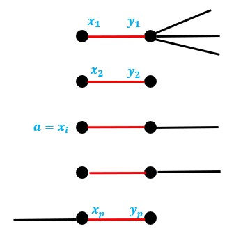
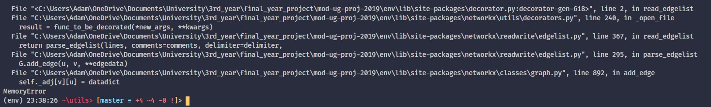
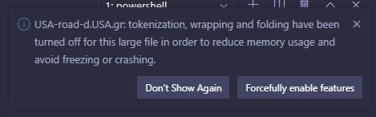
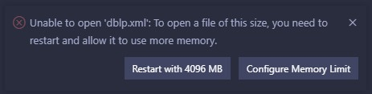

# On Parameterized Vertex Cover in Streaming

## Abstract

> The goal of the abstract is to give a complete overview of: the problem you identified, the approach you took/what you produced, your evaluation of it, what it all means.

[TOC]

## Introduction

> Remember your readers, especially your 2nd marker might have no knowledge of the topic of your project. The introduction is your chance to tell them what your project is about. What is the topic of your project? What are the problems? Why is it important? In the introduction you are trying, at a high-level to give the reader an idea of these issues. Convince them that your project is something interesting that's worth working on.

Parameterized Vertex Cover in Streaming. That is the problem.

When you think of streaming, Netflix may be the first thought that comes to mind. But Film and TV isn't the only thing that streaming can be used for. Streaming is now quite widely used in the enterprise space for real-time data. Where data is being reported from sensors in a system for use in monitoring. Streaming is also used in many systems for logging purposes. Actions that users make in a system need to be tracked for analytics so whenever they make an action an event log is created and sent to a stream of all the other users' actions. These can be then aggregated very quickly and efficiently to gain actual insight from.

~~

My supervisor Rajesh Chitnis had previously been researching the problem of parameterized vertex cover. I found that none of the algorithms he talked about had ever been put into practice, only ever written theoretically.

### The Problem

Parameterized Streaming Algorithms for the Graph Theory problem of Vertex Cover. That is the problem. Let me break that down into its individual parts.

Graph Theory: the study of mathematical structures which are used to show pairwise relations between objects.

Vertex Cover: a set of vertices such that each edge of a graph is incident to at least one vertex of the set. The problem of finding a minimum vertex cover (the smallest possible) is a classical optimization problem and is a typical example of an NP-hard problem. The decision version (where we only want a yes/no answer), known as the Vertex Cover Problem, is one of Karp's 21 NP-complete problems. This makes is a very classical problem. Formally, given a graph $G = (V, E)$ and a vertex cover $V'$:

$V' \subset V \text{ such that } \forall (u, v) \in E \Rightarrow u \in V' \vee v \in V' $

Parameterized complexity: A branch of computational complexity theory that focusses on classifying computational problems according to their inherent difficulty with respect to multiple parameters of the input or output. The complexity of the problem is then measured as a function of those parameters. The vertex cover problem is fixed-parameter tractable, meaning that, while it may be NP-complete in terms of the input size only, it is polynomial in the output of a vertex cover size $k$.

Streaming Algorithms: We now live in a world where data is the most valuable resource. Given such, it's no surprise that we're drowning in it. Datasets have become larger than what we can store on hard drives. The solution is to not store the dataset. Simply stream it as one item at a time. Streaming algorithms have been developed to handle this, being able to gather information while having access to a limited amount of memory.

### Why is this important?

Vertex cover is a classical problem which has found many use cases. Here's a typical example. Imagine a heavily connected road network in a city. The city council wants to figure out the most cost effective placement of cameras so that they are able to see every road (assume the cameras can see 360$^\circ$). The way of calculating this mathematically would be as a vertex cover of a graph where each intersection was a node and each road between them is an edge. For cities nowadays, this graph can be too big to compute using traditional methods. So we need updated methods to handle this.

### Branching

#### Historically

#### In Streaming


### Kernelization

#### Historically

#### In Streaming



### Adapting previous works into streaming

## Literature Review

## Methods

Python is good. Wide adoption in data science so has many tools in big data. Also, more importantly, used for many streaming applications in the Apache line-up.

Build first locally to test correctability. Implement a faux-stream using file streaming (reading line-by-line) then implement a proof-of-concept networked system to show how the system might be used in a real world example.

I identified three separate use cases where a vertex cover (or any graph) algorithm could be applied depending on the size and source of the graph given. These two attributes, size and source, each bubble down to two sub-cases.

Size:

- In-memory - The graph is small enough to store within memory. This means that actions can be performed on the graph taking in account the entire graph.
- Out-of-memory - The graph is too large to store within memory in it's entirety. Actions must now be made on small parts of the graph without the knowledge of other parts.

Source:

- Local - You have direct access to the graph, for example, in the form of a file.
- Stream - You do not have direct access, the data is streamed to you in pieces. This may be either due to the size of the data (it being too large to feasibly store) or due to the nature of the data. This nature being that it doesn't yet exist as stored data and so must be processed in some way from pre-existing data.

### Cases

#### Local

This is the traditional case. The graph is small enough to use in-memory and you have local access to it so you are able to use which ever tools you wish to calculate the vertex cover.

##### NetworkX




#### Local Stream

In this case the graph is no longer large enough to store in-memory but you are able to have direct access to it. The graph may be large but it is feasible to store the graph on disk since disk sizes are often many magnitudes larger than that of memory. Traditional algorithms are no longer applicable here, this is the first example where the invention of streaming algorithms is a necessity.

##### The Python `io` module

#### Stream

This is the main case. In a typical situation, knowledge of the graph's attributes will be limited so it should be treated as a unbounded stream (a stream that has no end). The opposite of this would be treating it as a bounded stream, where we know there is an end to the stream.

##### Batch vs Stream processing

Most "streaming" applications work on **unbounded** streams. These are data streams which are essentially infinite. Examples include: sensor readings and application logging. In these cases, the objective is not to obtain a final result but to aggregate the data before storing it for future use. This would be classed as **stream processing**.

Our problem of Vertex Cover would be classed as **batch processing**. We may be working on a data stream but once either algorithm has completed we won't need to run it again. 

Most streaming platforms (especially those in the Apache line up) work on unbounded stream processing. So finding a streaming platform appropriate for batch processing was a little more tricky. There are a number of "graph" processing frameworks.

> To build a streaming data pipeline, we'll need a few tools.
>
> First, you’ll require an in-memory framework (such as Spark), which handles batch, real-time analytics, and data processing workloads. You’ll also need a streaming platform (Kafka is a popular choice, but there are others on the market) to build the streaming data pipeline. In addition, you’ll also need a NoSQL database (many people use HBase, but you have a variety of choices available). 
>
> Step three is to fetch the data from the streaming platform. Next, we'll process the data. The fifth step is to manage the pipeline to ensure everything is working as it’s supposed to. 

Streaming platforms are the base on which a data stream is sent and received. Examples include:

- HTTP request
- HTTP streams
- Apache Kafka
- Apache Spark Streaming
- Google Cloud Pub/Sub

Once we have the platform we need an in-memory framework to handle the processing of each item in the stream. This is where the algorithms will actually run. There are a whole number of frameworks for this, all of which have their own niche use cases. Examples include:

- Apache Spark
- Apache Spark GraphX
- Apache Flink
- Apache Beam

##### Kafka and Faust

##### In-memory-sized stream graphs

If you know beforehand the size of the graph and it's of an in-memory size then you don't need to go through the hassle of treating it as a stream. One pass through the graph will allow you to store the graph locally and therefore be able to use it as a local graph instead.

### The algorithms

#### Branching - Non-Stream

```
Pseudocode
```

#### Branching - Stream

```
Pseudocode
```

#### Kernelization - Non-Stream

```
Pseudocode
```

#### Kernelization - Stream

```
Pseudocode
```

### Datasets

Eventually you get to a point when the datasets become too large to even read.


Visual Studio Code, a more modern text editor, is able to open the file however not without performance issues even when wrapping and folding have been turned off.



There is even a limit for Visual Studio Code though. 



### Testing and Comparison


## Results

> - What have you done?
> - What went into it?
> - Why have you done things the way you have done them?

### Runtime Analysis

|      |      |      |
| ---- | ---- | ---- |
|      |      |      |
|      |      |      |
|      |      |      |

`Insert graph here`

### Memory profiling

|      |      |      |
| ---- | ---- | ---- |
|      |      |      |
|      |      |      |
|      |      |      |

`Insert graph here`

## Evaluation

> - Did your idea work?
> - How did you test it?
> - What would you do differently?

If I had more time I would look into

- expanding the proof-of-concept into a full platform/website
- expanding it to more algorithms
- how the algorithms can be parallelized for greater performance
  - more operations in one pass vs less operations in more passes
- does including the lower bound of the vertex cover number into the binary search kernel give performance improvements

## Conclusion

> To finish up your report you’ll have a conclusion, your references and then your appendices. Your conclusions should be something of a mirror of the introduction. Remind the reader of what you did and what you found. What are the final ‘takeaways’ from your work? The project as a whole.