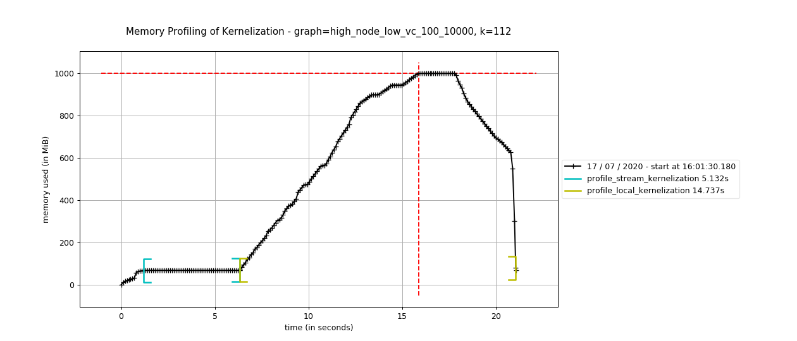

# Benchmark



This directory holds files to do with benchmarking space and time performance of the kernelization and branching algorithms. [memory-profiler](https://github.com/pythonprofilers/memory_profiler) is used for memory profiling and [pyperf](https://github.com/psf/pyperf) for time benchmarking.

## Steps to run memory profiling

**Note**: The `@profile` decorators which show as errors in the scripts are necessary to record when each function starts and stops as shown in the image above. If you want to run the code without profiling then comment out the decorators.

1. Run the profiler

```sh
$ mprof run .\benchmark_memory_branching.py
```

2. Plot the recorded memory usage

```sh
$ mprof plot
```

**Note**: `mprof plot` will plot the last recorded profiling.

## Steps to run time benchmarking

**Note**: These scripts take on the order of hours to complete depending on how many graphs you run it on.

1. Run the benchmark script.

```sh
$ python .\benchmark_time_branching.py -o output.json
```

2. Generate graph

```sh
$ python .\generate_benchmark_graph.py output.json
```

Pyperf includes a number of other statistical tools for analysis, see `pyperf --help`.
