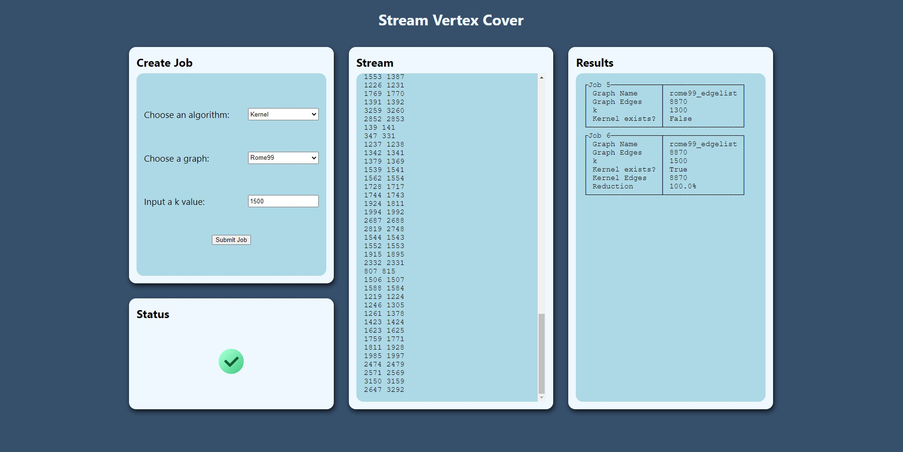

# Stream



This directory serves as a example of how these algorithms would be more typically implemented into a streaming framework such as Kafka. The website gives you options on the job you wish to process, this includes choosing the algorithm, graph, and a k value. On submit, you will see the edges of the graph stream down the middle column until the entire graph has been processed and a results table will appear in the right column.

In order to run Kafka, ZooKeeper is also needed so a docker-compose file has been provided for ease of use.

Breakdown of programs:

- `stream.py`: Runs Faust and uses it's web server feature to host a single page from which the user can create processing jobs and access results
- `stream-producer.py`: Also runs Faust but acts as an off-site server, responding to graph requests and streaming edges of the graph back

## Steps to run

1. Start ZooKeeper and Kafka

```sh
$ docker-compose up -d
```

2. Start the producer

```sh
$ python stream_producer.py worker -l info
```

3. In another terminal, start the web server

```sh
$ python stream.py worker -l info
```

4. Visit http://localhost:6066

### To shutdown

1. Ctrl+C to exit python programs
2. Once python programs have successfully exited, stop ZooKeeper and Kafka

```sh
$ docker-compose down
```
