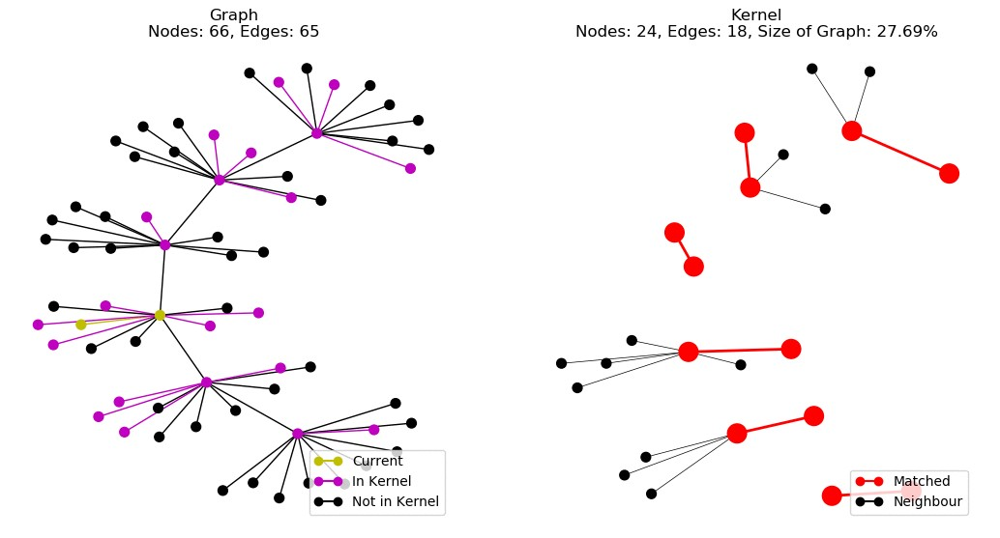

# Visuals



This directory contains programs to generate visualisations of the Kernelization and Branching streaming algorithms.

## How to run

In all cases, use the flag `--help` or `-h` to show the help page to view all options

### Kernel Demo

```sh
$ python kernel_stream_demo.py <edge_list_file> <k> [options]
```

This program is for showing live demonstration of the Kernelization algorithm. It is displayed in a Matplotlib figure so there is no control over playback.

### Kernel Animation

```sh
$ python kernel_stream_animation.py <edge_list_file> <k> <output_name> [options]
```

This program is for saving videos for future use. It exports to any desired format provided that you have [ImageMagick](https://imagemagick.org/) installed. You specify your desired export format in the `output_name` option given in the command line (e.g. `test.gif`).
